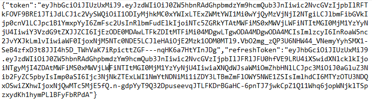
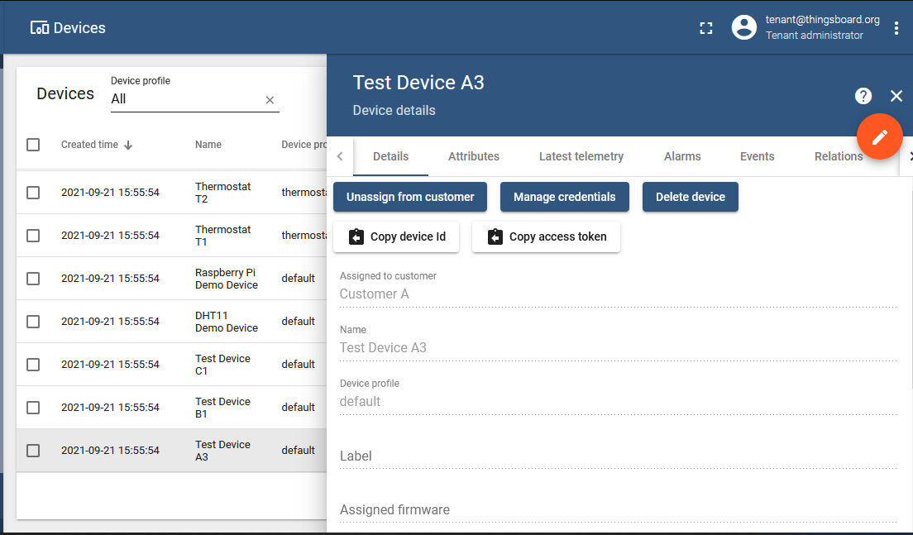
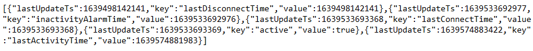
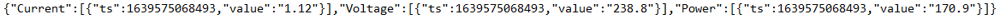
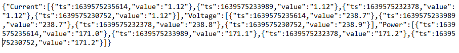
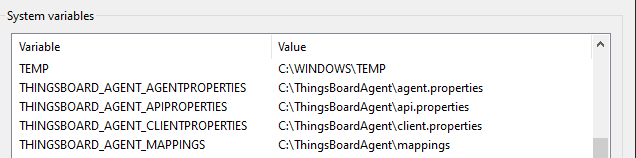

# ThingsBoard input agent

This agent is for maintaining data and the corresponding instances in the knowledge graph (KG) regarding sensor measurements send to a ThingsBoard server.
It's only purpose is to retrieve new data (if available) from the API and download it into 
the corresponding database, as well as, instantiating KG instances and connection when called for the first time. The 
agent uses the [time-series client](https://github.com/cambridge-cares/TheWorldAvatar/tree/develop/JPS_BASE_LIB/src/main/java/uk/ac/cam/cares/jps/base/timeseries)
from the JPS base lib to interact with both the KG and database.

Before explaining the usage of the agent, we will briefly summarize the ThingsBoard API that is contacted by one of the classes in this package to retrieve data.

## ThingsBoard API

The API will be briefly described here. 
Official documentations regarding the API can be found [here] (https://thingsboard.io/docs/user-guide/telemetry/#data-query-rest-api).

### Prerequisite
To use the API, a ThingsBoard server must be already set up and running. Some parts of the sections below apply solely for the commmunity edition
which is 100% open source and free. Installation options can be found [here] (https://thingsboard.io/docs/user-guide/install/installation-options/).
Another prerequisite is to have readings/measurements send to the ThingsBoard server. This can be done by connecting some sensors to a micro-controller
board such as the Arduino and do some programming such that the board can send the measurements to the ThingsBoard server via Wi-Fi and API. An example
can be found [here] (https://thingsboard.io/docs/samples/arduino/temperature/).

### Token retrieval
Before the API can be used to retrieve entity data from the ThingsBoard server, a JWT Token needs to be obtained first.

The token can be retrieved from the following endpoint using a HTTP POST request:
```
http://localhost:[port no.]/api/auth/login
```
The default [port no.] is usually set to 8080 but it can be changed if required.

The body of the request needs to contain the credentials in form of a JSON object, the default username and password is shown in the 
following example:
```json
{"username":"tenant@thingsboard.org", "password":"tenant"}
```

The response should then contain the token in the response body if the request was successful, like shown here:



The token will be valid for 150 minutes for using it in following requests. To use the token it needs to be added to
the header of the request (how to exactly do it depends on which software and package is used for making the request):
```
X-Authorization: Bearer [token]
```

### Server status
To check whether the server is available and receiving data from the sensors, the endpoint is:
```
http://localhost:[port no.]/api/plugins/telemetry/[entityType]/[entityId]/values/attributes
```
Supported entity types include TENANT, CUSTOMER, USER, DASHBOARD, ASSET, DEVICE, ALARM, ENTITY_VIEW. The default entity type should be DEVICE.

entityId can be obtained by following the steps:
- Access the ThingsBoard server via any browser with the URL http://localhost:[port no.]
- Click on devices, choose the device to retrieve data from
- Click "copy device Id" under device details 



When available and if the GET request is correct, the response body should look similar to the following:



The section ["key":"active","value":true] indicates that the server is available and is currently receiving data from the sensors.

### Data retrieval
Data can be retrieved via two methods. One allows the retrieval of the latest time-series data while the other allows the retrieval of
historical time-series data from a starting timestamp to an ending timestamp.

#### The endpoint
The endpoint for retrieval of latest telemetry data has the following structure and controls what type of data is retrieved:
```
http(s)://host:port/api/plugins/telemetry/{entityType}/{entityId}/values/timeseries?keys=key1,key2,key3
```
where `[keys]` represent the types of readings to be retrieved from the server.

The endpoint for retrieval of historical timeseries data has the following structure and controls what type of data is retrieved:
```
http(s)://host:port/api/plugins/telemetry/{entityType}/{entityId}/values/timeseries?keys=key1,key2&startTs=[start]&endTs=[end]&interval=[interval]&limit=[no.]&agg=[..]
```
where `[keys]` represents the types of readings to be retrieved from the server, `[startTs]` and `[endTs]` represents the starting and ending unix timestamps
in milliseconds, `[interval]` represents the aggregation interval in milliseconds, `[limit]` represents the max amount of data points to be retrieved, 
`[agg]` represents one of the aggregation function: MIN, MAX, AVG, SUM, COUNT, NONE. 

#### Example readings
Readings are returned in the response body in form of a JSON Object which consist of key-value pairs. The values are in the form of JSON Arrays 
which contains multiple JSON Objects. Each JSON Objects consist of two key-value pairs with the keys being "ts" and "value" respectively.

The following shows a single JSON object for latest time-series data for multiple keys:



The following shows a single JSON object for historical time-series data for multiple keys:



## Usage 
This part of the README describes the usage of the input agent. The module itself can be packaged into an executable war, deployed as a web servlet on tomcat. 
Sending the appropriate request to the correct URL will initiate the agent. Since it uses the time-series client which maintains both instances in a 
knowledge graph and a Postgres database to store the data, these will be required to be set-up before.  

The [next section](#requirements) will explain the requirements to run the agent.

### Requirements
It is required to have access to a knowledge graph SPARQL endpoint and Postgres database. These can run on the same machine 
or need to be accessible from the host machine via a fixed URL.

This can be either in form of a Docker container or natively running on a machine. It is not in the scope of this README
to explain the set-up of a knowledge graph triple store or Postgres database.

### Property files
For running the agent, three property files are required:
- One [property file for the agent](#agent-properties) itself pointing to the mapping configuration.
- One [property file for the time-series client](#time-series-client-properties) defining how ot access the database and SPARQL endpoint.
- One [property file for the ThingsBoard API](#api-properties) defining the access credentials(username, password, device Id), path URL and keys.

#### Agent properties
The agent property file only needs to contain a single line:
```
thingsboard.mappingfolder=[mappings_folder_environment_variable]
```
where `[mappings_folder_environment_variable]` is the environment variable pointing to the location of a folder containing JSON key to IRI mappings. 
An example property file can be found in the `config` folder under `agent.properties`. See [this section](#mapping-files) of the README for an 
explanation of the mapping files.

#### Time-series client properties
The time-series client property file needs to contain all credentials and endpoints to access the SPARQL endpoint of
the knowledge graph and the Postgres database. It should contain the following keys:
- `db.url` the [JDBC URL](https://www.postgresql.org/docs/7.4/jdbc-use.html) for the Postgres database
- `db.user` the username to access the Postgres database
- `db.password` the password to access the Postgres database
- `sparql.query.endpoint` the SPARQL endpoint to query the knowledge graph
- `sparql.update.endpoint` the SPARQL endpoint to update the knowledge graph

More information can be found in the example property file `client.properties` in the `config` folder.

#### API properties
The API properties contain the credentials to authorize access to the ThingsBoard API (see the [API description](#thingsboard-api)),
the port number and keys. It should contain the following keys:
- `thingsboard.username` the username to access the API.
- `thingsboard.password` the password to access the API.
- `path.url` the URL for where the ThingsBoard server is located, the default should be http://localhost:8080. 
- `deviceId` the device Id that indicates which device to retrieve the data from. 
- `keys` the keys that represents the parameters/readings to be retrieved from the ThingsBoard server.
More information can be found in the example property file `api.properties` in the `config` folder.

#### Mapping files
What are the mapping files and why are they required? The mapping files define how data received from the API is connected
to the knowledge graph (KG). Specifically, each JSON key in the readingsrepresents a specific measure that needs to be 
represented by an IRI, if it should be saved in the database.

Furthermore, measures can be grouped into one time-series (will result in one time-series instance per group in the KG).
This should be done so that all measures in one group are recorded at the same time interval, and so they come from 
the same readings. However, it is possible to break down the readings into smaller, logical groups.

The mapping is achieved in this package by using one property file per group. Each property file contains one line per 
JSON key that should be linked to an IRI, e.g. like:
```
co_slope=http:/example/co_slope
```
If the IRI is left empty (`co_slope=` in the example), i.e. because there is no instance that represents the measure yet, 
it will be automatically created when the agent is run for the first time. This automatically generated URI will have the
following form:
```
[prefix]/[key]_[UUID]
```
where the `[prefix]` is hardcoded into the `ThingsBoardInputAgent` class in a public, static field called `generatedIRIPrefix`
which is based on the time-series client namespace, `[key]` is the JSON key the URI is generated for, and `[UUID]` is a 
randomly generated UUID.

Note, that not all JSON keys need to be represented in the mapping files (the data will simply be ignored and not stored), 
but there needs to be a 1-1 mapping, i.e. no IRI can be used for multiple JSON keys.

To ensure that the same IRIs are used for each JSON key, the mapping files are saved back after each run (only really 
necessary when some of them are automatically generated). Note, that if you change any mapping in preceding runs, they 
will be seen as new time-series, which can result in inconsistencies in both the KG and database.

Examples for the structure of the mapping folder and files can be found in the `mapping` folder within the `config` 
folder. 

### Setting up the Agent as a web servlet

#### Install tomcat
To run the agent on your PC, you must have tomcat installed on your machine. 
It can be installed [here] ( https://tomcat.apache.org/download-90.cgi).

#### Building the War
To build the war file of this agent, you need to have [Maven](https://maven.apache.org/) installed. The current version
of the code was tested with version 3.8.1 running on Windows. In addition, the machine needs to be able to access the 
CMCL Maven repository for downloading the JPS base lib dependency and default logging configuration. Check the 
[wiki](https://github.com/cambridge-cares/TheWorldAvatar/wiki/Packages) for how to set it up. Example Maven settings 
files are provided in the `.m2` folder.

If everything is set up, the war file can be built using the following command in a terminal from within the 
`ThingsBoardInputAgent` folder (in which the `pom.xml` is located):
```
mvn clean package
```

Maven will automatically run all unit tests before packaging. The war file can then be found in a `output` folder.


#### Run the agent
To run the agent, firstly, copy the mapping folder and the 3 properties files in the `config` folder and place them in a new folder somewhere else.
Modify the mapping file and properties files accordingly. Add new environment variables pointing to the location of the mapping folder and the 3 properties files.



As described [above](#mapping-files), mapping configurations are required as well (the location can be set in the agent property file). 
These mapping files need to be kept persistent, so once the agent is run they should not be modified anymore. 

Copy the war file found in the `output` folder and paste it into the webapps folder within the tomcat directory. 
By default the webapps folder can be found by following this path C:\Program Files\Apache Software Foundation\Tomcat 9.0\webapps.
Next, start up tomcat 9.0, this will allow the web servlet to be deployed successfully.

To run the agent, a POST request must be sent to http://localhost:8080/thingsboard_inputAgent/retrieve with a correct JSON Object.
Follow the request shown below. The values THINGSBOARD_AGENT_AGENTPROPERTIES, THINGSBOARD_AGENT_APIPROPERTIES, THINGSBOARD_AGENT_CLIENTPROPERTIES
are the environment variables pointing to the location of the 3 properties files. These can be changed depending on what you named the environment variables
but the keys agentProperties, apiProperties, clientProperties must be fixed.

```
POST http://localhost:8080/thingsboard_inputAgent/retrieve
Content-Type: application/json
{"agentProperties":"THINGSBOARD_AGENT_AGENTPROPERTIES","apiProperties":"THINGSBOARD_AGENT_APIPROPERTIES","clientProperties":"THINGSBOARD_AGENT_CLIENTPROPERTIES"}"
```

If the agent run successfully, you should see a JSON Object returned back that is similar to the one shown below.
```
{"Result":["Input agent object initialized.","Time series client object initialized.","API connector object initialized.","Retrieved 8 electrical, temperature and
 humdity readings.","Data updated with new readings from API.","Timeseries Data has been updated."]}
```

If the JSON Object returned back is as shown below, it means that the request was written wrongly. Check whether the URL, keys and values are written correctly.
```
{"Result":"Request parameters are not defined correctly."}
```